

# More than a feeling?
#### Reliability and robustness of high-level music classifiers
C. Mostert (4473353)

---

# High-level music classifiers can be great!
- Personalized music recommendations
- Searching for specific music
- ...or even *tell us something about the listener?*

---
# The first idea
Combining [The Music Listening Histories Dataset](https://ddmal.music.mcgill.ca/research/The_Music_Listening_Histories_Dataset_(MLHD)/#:~:text=The%20Music%20Listening%20Histories%20Dataset%20(MLHD)%20is%20a%20large%2D,logs%20extracted%20from%20Last.fm.&text=a%20set%20of%20user%20profiling,music%20listening%20behavior%20and%20activity) with [AcousticBrainz](http://mtg.upf.edu/node/3320)

But... Spotify recently had the same idea [(Park et al., 2019)](https://doi.org/10.1038/s41562-018-0508-z)

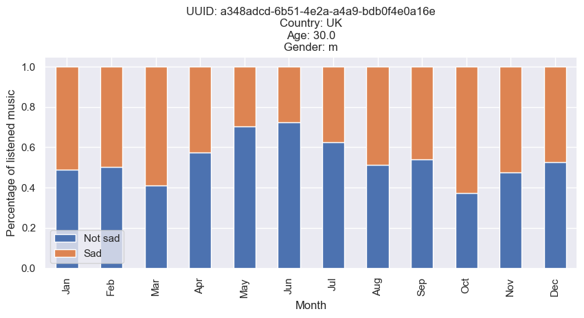

---
# My assumption...

Multiple submissions should be redundant, *right?*

---
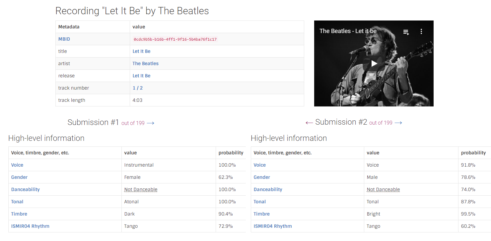

---
# *What* is the problem?

Sharing commercial music audio is illegal
Use *precomputed low-level features*
MFCCs and chroma features are sensitive to *representation* [(Urbano et al., 2014)](http://mtg.upf.edu/node/3015)

<!-- _footer:  $~~~$[Image source](http://www.clker.com/clipart-11202.html)-->

---
# *What* is the problem?

Labels can be **ambiguous**

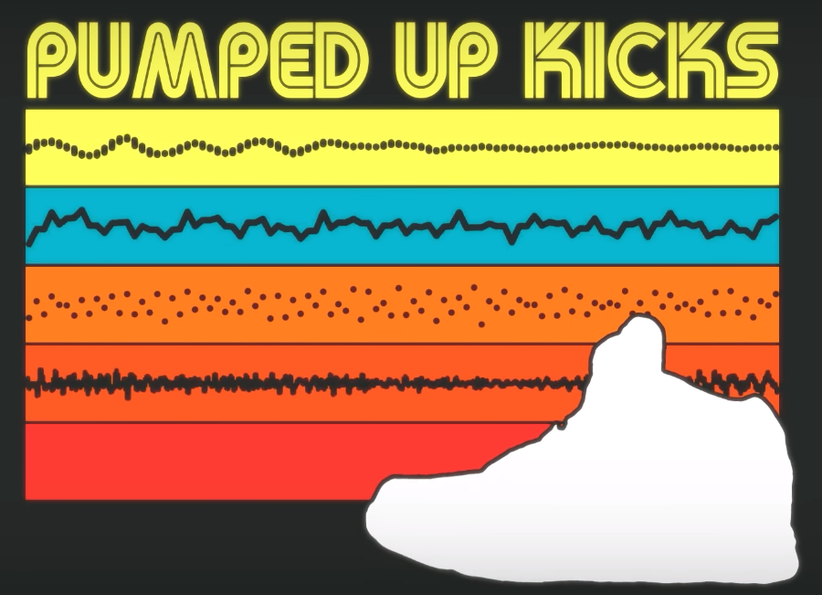
<!-- Use for example pumped up kicks for emotion, or the label 'party', which can be culturally dependent -->

<!-- _footer:  $~~~$Still taken from [Middle 8](https://youtu.be/LDFMmZ4IvX4)-->

---
# *What* is the problem?

Modelling emotion requires knowledge from psychology

Which model to use?

Be careful with interpretation

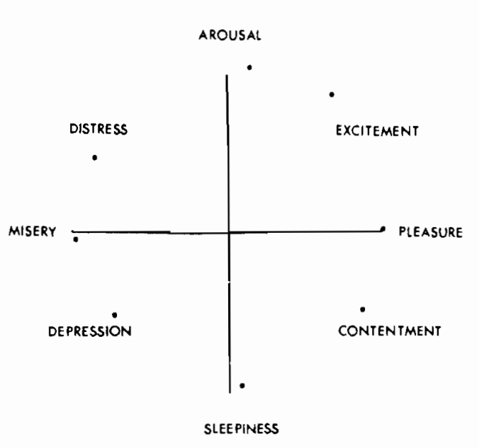
<!-- _footer:  $~~~$Image from [(Russell, 1980)](https://content.apa.org/doi/10.1037/h0077714)-->

---
# *What* is the problem?

Trained classifiers are not explainable
No good ways of validating

<!-- _footer:  $~~~$[Image source](https://blackboxofpm.com/the-black-box-of-product-management-3feb65db6ddb)-->

---
# *Why* should we care?
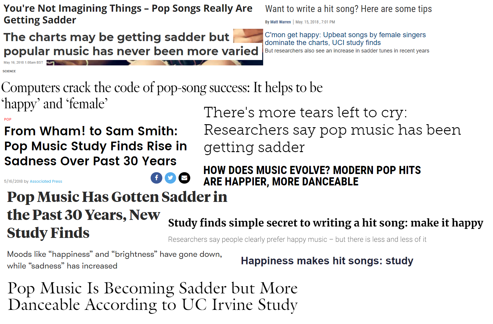

<!-- For consistency, they only looked at the first submission for each MBID, and did note that the codec/bitrate could influence these values. However, journalism then likes to jump to conclusions-->

<!-- _footer:  $~~~$Headlines all based on results by [(Interiano et al., 2018)](https://doi.org/10.1098/rsos.171274)-->

---

# <!-- fit --> Then *how* are we going to measure classifier performance?

---
# Stability analysis
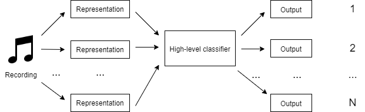
<!-- Mainly to see how the instability of low-level features cascades towards the high-level classifiers -->

---
# Stability analysis
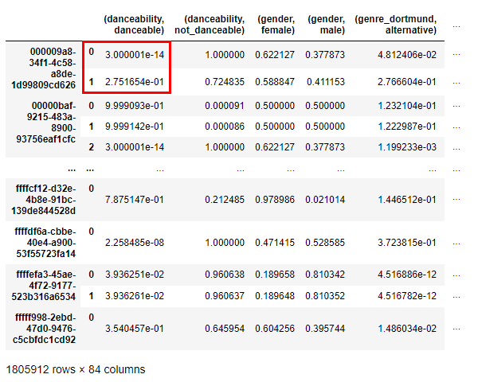
Where the red box is indexed as $(MBID_1, danceability, danceable)$

---
# Stability analysis
Then $var((MBID_1, danceability, danceable))$ gives us information about the stability of this classifier **over one recording**

How do we use **all recordings**?

---
# Stability analysis
We calculate the **pooled variance**:
$$\overline{var}(c,l)=\frac{\Sigma_{i=1}^{k} (n_i \times var((MBID_i, c, l)))}{\Sigma_{i=1}^{k}n_i}$$
Where $n_i$ is the sample size of population $i$

---
# Stability analysis
But what about classifiers who almost always output the same label?
We need some measure of this 'biasedness'

---
# Stability analysis
Use **information entropy**
We assume that underlying data is uniformly distributed over labels

$$\hat{H}(c)_{all}=-\Sigma_{l \in L_c}P((c, l))log_{|L_c|}P((c, l))$$

Where $L_c$ is the set of labels for classifier $c$.

---
# Stability analysis
Now we can quantify classifiers based on their stability and 'biasedness':
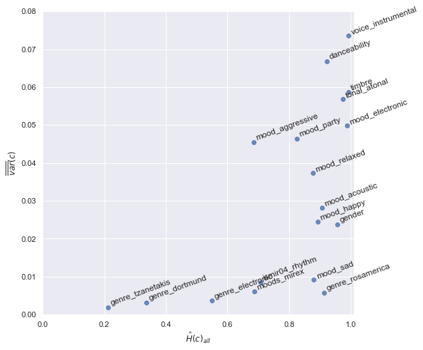
<!-- 
Note that y-axis averaged pooled variance over all possible labels

Bottom right is best, lowest bias + highest stability. Many classifiers are either stable and biased or if they are less biased then they also become more stable. In essence, we can see the bias-variance tradeoff often discussed in machine learning. Only some classifiers, like mood_sad or genre_rosamerica seem to be relatively stable **and** unbiased.-->

---
# Can we use the stability metric to say something about how the representation of the audio influences high-level music classifiers? 

Due to the metric requiring multiple submissions, we cannot control the underlying data...

---
Still, data suggests an influence of bitrate on stability
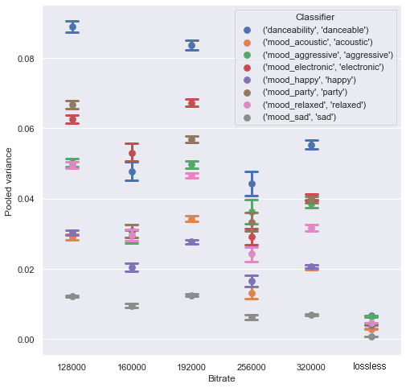

---
Of some codecs on stability
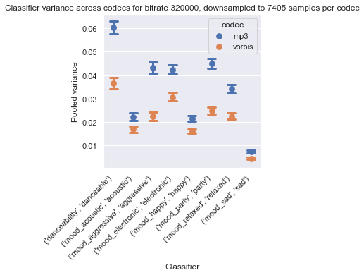

---
And even of the low-level version extractor version used on the stability
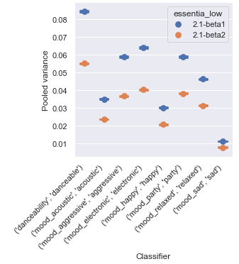

---
# Can we define another metric which does not require multiple submissions?

---
# Classifier agreement

Main idea: two classifiers implementing the same or similar tasks should **agree** with eachother

Quantified by calculating the **Pearson correlation** between confidence values
<!-- can also be related to construct validity in psychology, if unsure if the construct is correctly captured, do multiple measurements and see if they correspond -->

---
# Classifier agreement
There is **redundancy** in the AcousticBrainz classifiers

| Classifier, label A      | Classifier, label B      | Pearson r        |
|--------------------------|--------------------------|--------------|--------|
| genre_rosamerica, cla | genre_tzanetakis, cla | 0\.287475    | <.001 |
| genre_dortmund, blues | genre_tzanetakis, blu | 0\.00790441  | <.001 |
| genre_rosamerica, roc | genre_tzanetakis, roc | \-0\.074783  | <.001 |

---
# Classifier agreement
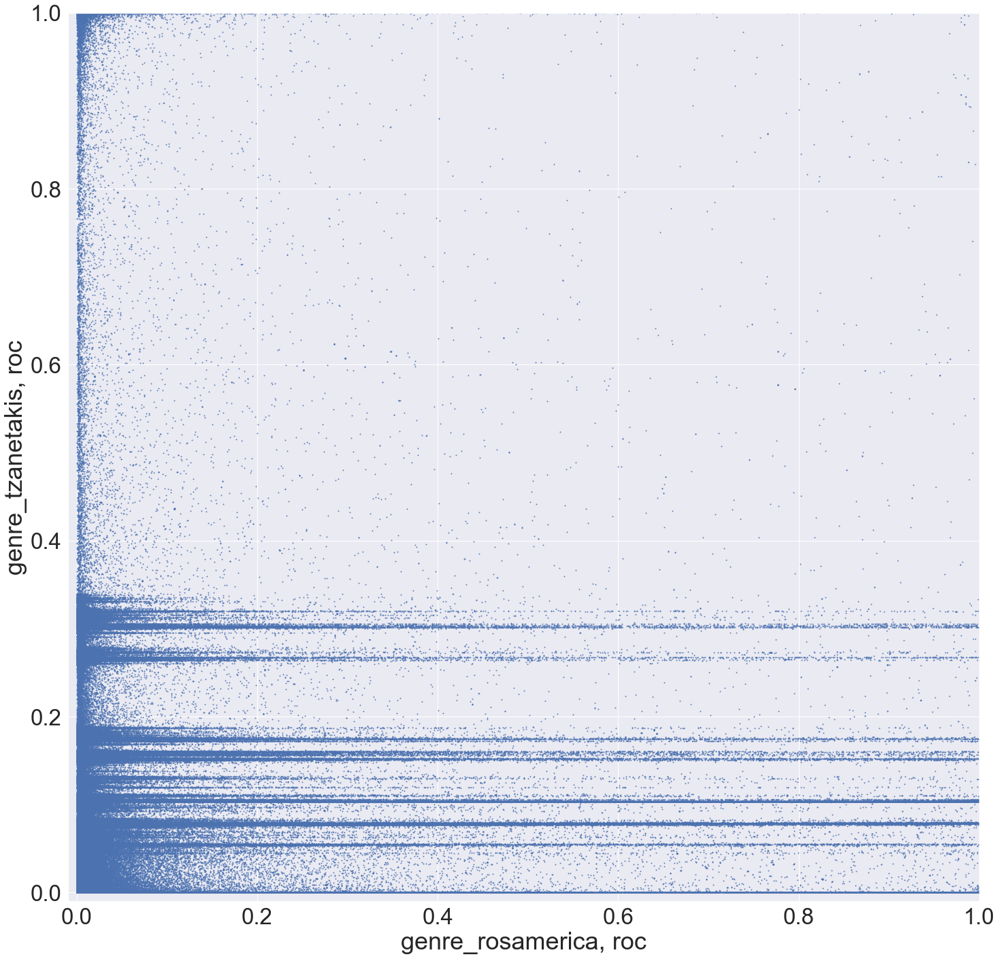

---
# Classifier agreement
What about related constructs?
| Classifier, label A            | Classifier, label B                   | Pearson r    |
|--------------------------------|---------------------------------------|-----------|--------|
| mood_aggressive, aggressive | mood_relaxed, not_relaxed       | 0.588771 | <.001 |
| danceability, danceable        | mood_party, party                  | 0.527954 | <.001 |
| mood_happy, happy           | mood_sad, not_sad               | 0.131705 | <.001 |

---
# Classifier agreement
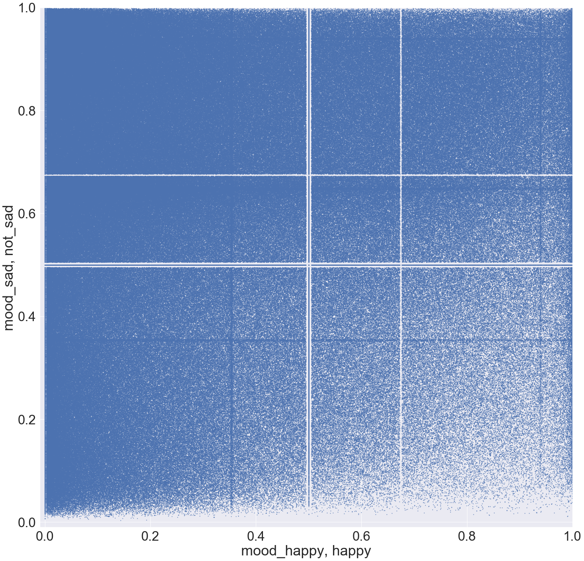

---
# Now we can at least control for the data!
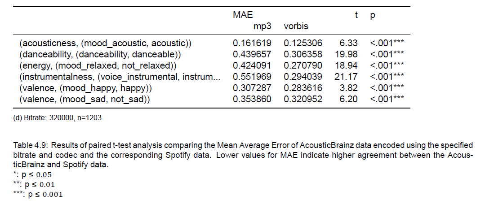

---

# Going down the rabbit hole: can we gain further insight into what causes these strange distributions?

---
# A closer look at the distributions
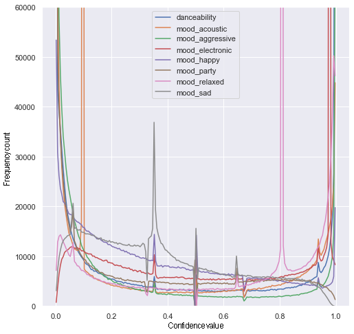

---
# Are these peaks caused by differences in data representation?
Main idea: compare metadata value distributions of data in peak with 'baseline'
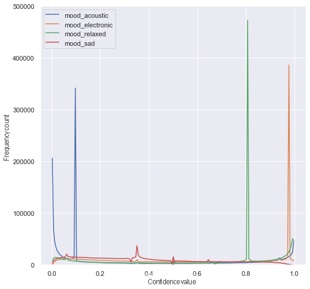

---
# Distance metric
The Jensen-Shannon distance is used as a measure of distributional difference
> The square root of the Jensen-Shannon Divergence [(Endres & Schindelin, 2003)](https://doi.org/10.1109/TIT.2003.813506).
> Symmetric, finite value within [0, 1] [(Lin, 1991)](https://doi.org/10.1109/18.61115).

---
# Distributional differences in metadata
|                         | acoustic | relaxed | electronic | sad |
|---------------------------------|----------------------|---------------------|------------------------|-----------------|
| bit_rate                     | \.42                 | \.32                | \.39                   | \.17            |
| codec                           | \.34                 | \.26                | \.32                   | \.06            |
| length                          | \.15                 | \.15                | \.15                   | \.32            |
| lossless                        | \.28                 | \.21                | \.27                   | \.02            |
| essentia_low                 | \.61                 | \.52                | \.59                   | \.15            |
| essentia_git_sha_low   | \.67                 | \.58                | \.66                   | \.23            |
| essentia_build_sha_low | \.70                 | \.62                | \.69                   | \.24            |

---
# What about genre differences?
Using the [AcousticBrainz genre dataset](http://mtg.upf.edu/node/3960) we can check the distrubtional differences in genre in the peaks

|      | acoustic | relaxed | electronic | sad |
|----------|----------------------|---------------------|------------------------|-----------------|
| Discogs  | .12                 | .09                | .11                   | .11            |
| last.fm | .14                 | .12                | .13                   | .14            |
| tagtraum | .14                 | .11                | .13                   | .14            |

---
# Climbing back up: what have we learned?
- There are reasons to doubt high-level classifier performance from a theoretical point of view
- Stability, agreement and distributional anlyses highlight several classifiers that seem to perform poorly and show unexpected patterns
- Low-level extractor versions, codec or bitrate used seem to play a role in high-level classifier performance

---
# Maybe the metadata effects are all due to the changes in underlying data?

- Agreement metric allowed for controlling the data
- What about the stability metric?

---
# We can make the underlying data more homogeneous
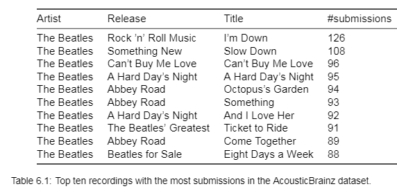

---
# The same general patterns remain visible
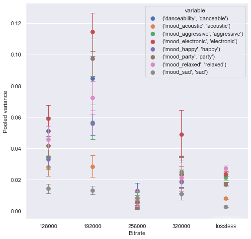
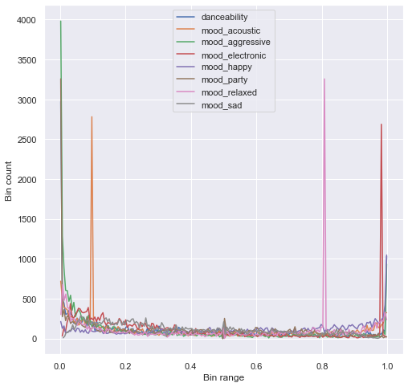

---
# If we control for representation, how do the metrics change?
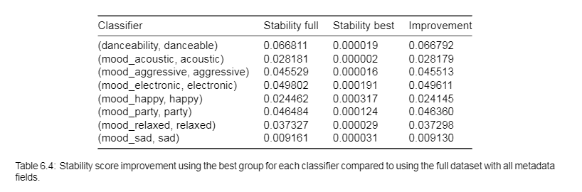
<!-- Selecting any combination seemed to benefit the stability -->

---
# What about agreement?
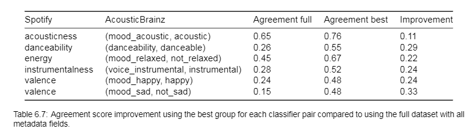

---
# Low-level extractor versions, codec or bitrate used seem to play a role in high-level classifier performance

---
# Where to go from here?
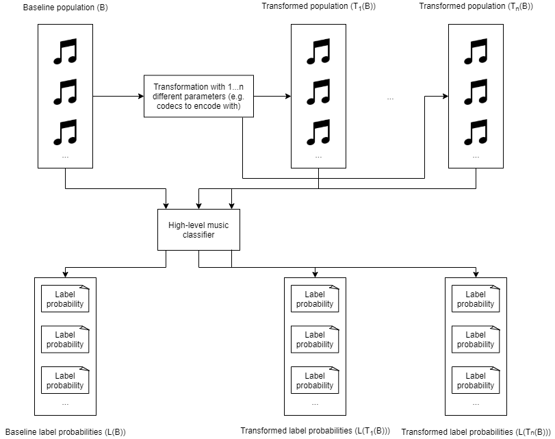
<!-- Collect large amount of CD quality audio, transform one of the representational differences at a time and do a proper controlled study. Was now impossible due to the dataset -->

---
# What about the software?
- Each entry has a git-SHA
- Use differences in output as **indicator**
- Can then perform differential testing [(McKeeman, 1998)](https://www.semanticscholar.org/paper/Differential-Testing-for-Software-McKeeman/fc881e8d0432ea8e4dd5fda4979243cac5e4b9e3)

<!-- Essentially show the same input to different versions of the system -->

---
# 'Stress testing' the trained classifier
- No available oracle
- *Metamorphic relation*: output should stay the same for imperceptible change in input
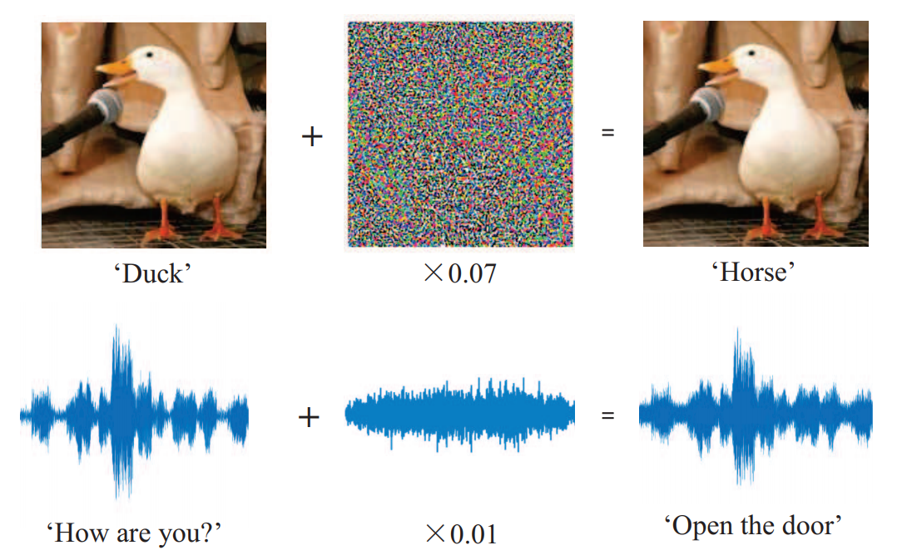
<!-- _footer:  $~~~$Image from [(Gong & Poellabauer, 2018)](http://arxiv.org/abs/1803.09156)-->

---
# How can we find such perturbations?
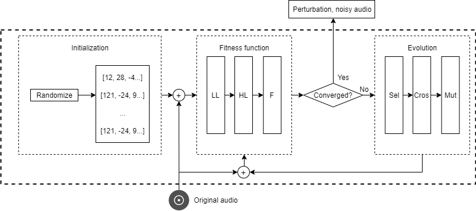

---
# In conclusion
- Current high-level classifiers should be used with caution
- Stop optimizing, start evaluating
- Not just relevant for MIR

---

---
#### Bibliography
###### Bogdanov, D., Porter, A., Schreiber, H., Urbano, J., & Oramas, S. (2019). The AcousticBrainz genre dataset: Multi-source, multi-level, multi-label, and large-scale. Proceedings of the 20th Conference of the International Society for Music Information Retrieval (ISMIR 2019): 2019 Nov 4-8; Delft, The Netherlands.[Canada]: ISMIR; 2019.

###### Endres, D. M., & Schindelin, J. E. (2003). A new metric for probability distributions. IEEE Transactions on Information Theory, 49(7), 1858–1860. https://doi.org/10.1109/TIT.2003.813506

###### Gong, Y., & Poellabauer, C. (2018). An Overview of Vulnerabilities of Voice Controlled Systems. arXiv:1803.09156 [cs]. http://arxiv.org/abs/1803.09156

###### Interiano, M., Kazemi, K., Wang, L., Yang, J., Yu, Z., & Komarova, N. L. (2018). Musical trends and predictability of success in contemporary songs in and out of the top charts. Royal Society Open Science, 5(5), 171274. https://doi.org/10.1098/rsos.171274

---
###### Lin, J. (1991). Divergence measures based on the Shannon entropy. IEEE Transactions on Information Theory, 37(1), 145–151. https://doi.org/10.1109/18.61115

###### McKeeman, W. M. (1998). Differential testing for software. Digital Technical Journal, 10(1), 100–107.

###### Park, M., Thom, J., Mennicken, S., Cramer, H., & Macy, M. (2019). Global music streaming data reveal diurnal and seasonal patterns of affective preference. Nature Human Behaviour, 3(3), 230–236. https://doi.org/10.1038/s41562-018-0508-z

###### Porter, A., Bogdanov, D., Kaye, R., Tsukanov, R., & Serra, X. (2015). AcousticBrainz: A Community Platform for Gathering Music Information Obtained from Audio. ISMIR.

---

###### Russell, J. A. (1980). A circumplex model of affect. Journal of personality and social psychology, 39(6), 1161.

###### Urbano, J., Bogdanov, D., Boyer, H., Gómez Gutiérrez, E., & Serra, X. (2014). What is the effect of audio quality on the robustness of MFCCs and chroma features? Proceedings of the 15th Conference of the International Society for Music Information Retrieval (ISMIR 2014); 2014 Oct 27-31; Taipei, Taiwan. International Society for Music Information Retrieval; 2014. p. 573-578.

###### Vigliensoni, G., & Fujinaga, I. (2017). The Music Listening Histories Dataset. ISMIR.
